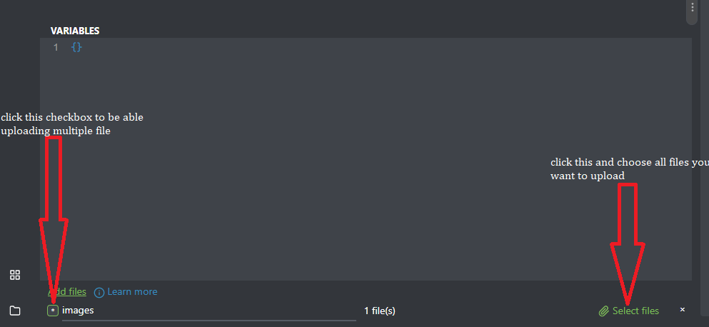

# <h1>TECHZARA_WCC2_s3</h1>

# Toy eXchange GraphQL API

## Description
 
<p>A GraphQL API build build with Laravel. </p>

## prerequisites : 
- port 8000 is used by laravel server so it's better to respect that.
- composer.
- xampp ou lampp ou mampp.
- For test you can use [Graphiql](), [Graphql-playground]() [Postman]() but I recommended to use [Altair](https://l.facebook.com/l.php?u=https%3A%2F%2Faltairgraphql.dev%2F%3Ffbclid%3DIwAR1zH03yLskaJeVBzbFE5e5DBnVghlPIYAMD06Vz1bQAUk55GvBD9a4sqXY%23download&h=AT2fJn1uNq75A3EHxC8aRKPliLsPMt7JOk4NuJNntoc8lnyaJ5o1vcIEfpoldZqUg7xC_2T1oCzvQAf0l4tNPtt5QSo4NfKRLmyYQGipFjtbtCmx5OmGMGzh2CtNO9OCBEHo3_TIXjzhR9I)

For Altair, it is better to download the proper browser extension:

|Browser | Link
| -----  | :-: |
|Chrome | [Get it Here](https://l.facebook.com/l.php?u=https%3A%2F%2Fchrome.google.com%2Fwebstore%2Fdetail%2Faltair-graphql-client%2Fflnheeellpciglgpaodhkhmapeljopja%3Ffbclid%3DIwAR1iyRiUHV8ScFWfNccR02VnwTNJCYJyffmPIoOJyj-nUrKu6SnTp8BXWOE&h=AT0Nu5V-wEDIxfQ5aZ2d3xIEZjm0jSqGUZm32tZJGoakHpkkaMBDt1d9jzDY-sKvg5LgdB66rjRRv563YW5wjodEmK99mxKOqomd7pv6o-SRwEpZQzc19Rpv_2TTR9l6r-WdpA)
|Firefox | [Get it Here](https://l.facebook.com/l.php?u=https%3A%2F%2Faddons.mozilla.org%2Fen-US%2Ffirefox%2Faddon%2Faltair-graphql-client%2F%3Ffbclid%3DIwAR3DHxVDAqv2mB5qrhQAEDZMrLplfn5Emd2PJgnvWro96G2JS8ic4QRiAT0&h=AT0Nu5V-wEDIxfQ5aZ2d3xIEZjm0jSqGUZm32tZJGoakHpkkaMBDt1d9jzDY-sKvg5LgdB66rjRRv563YW5wjodEmK99mxKOqomd7pv6o-SRwEpZQzc19Rpv_2TTR9l6r-WdpA)
|Edge | [Get it Here](https://l.facebook.com/l.php?u=https%3A%2F%2Fmicrosoftedge.microsoft.com%2Faddons%2Fdetail%2Faltair-graphql-client%2Fkpggioiimijgcalmnfnalgglgooonopa%3Ffbclid%3DIwAR2JYg15Ro-m1dCUd16OFhKmNBmQkN2PfRNRfyHKEuQD5iDwBDNiOolwJ6g&h=AT0Nu5V-wEDIxfQ5aZ2d3xIEZjm0jSqGUZm32tZJGoakHpkkaMBDt1d9jzDY-sKvg5LgdB66rjRRv563YW5wjodEmK99mxKOqomd7pv6o-SRwEpZQzc19Rpv_2TTR9l6r-WdpA)

## Installation

- copy the `.env.example` and rename it to `.env` .
- create database `exchange_toy` and import the file `exchange_toy.sql` into database , </br>
    <b>OR</b> 
- migrate if you want empty database</p>

``` php
php artisan migrate
```
- install all the dependencies and all requirements.
 
``` php
composer install
```
- create a symbolic link to access storage folder.

```php
php artisan storage:link
```
- run the server

```php
php artisan serve
```
## Queries 

- In the query `count` is the number of item per page, and `page` is the index of the current page.
### listAllUser 
- Description :
   <p>List all user and all their toy. </p>
- Query :  
```GraphQL
query{
  listAllUser(count:2, page:1){
    current_page
    data{
      user_name
      contact
      toys{
        toy_name
        exchange_to
        status
        images{
          toy_uri
        }
      }
    }
  }
}
```
- result example :
```GraphQL
{
  "data": {
    "listAllUser": {
      "current_page": 1,
      "data": [
        {
          "user_name": "Harilaza",
          "contact": "261385027232",
          "toys": [
            {
              "toy_name": "Coding game",
              "exchange_to": "Programming",
              "status": "inactive",
              "images": [
                {
                  "toy_uri": "http://localhost:8000/storage/toy/Coding game1.jpg"
                },
                {
                  "toy_uri": "http://localhost:8000/storage/toy/Coding game10.png"
                }
              ]
            }
          ]
        },
        {
          "user_name": "Onimalala",
          "contact": "261349000230",
          "toys": [
            {
              "toy_name": "Hamburger",
              "exchange_to": "Pain",
              "status": "active",
              "images": [
                {
                  "toy_uri": "http://localhost:8000/storage/toy/Hamburger5.jpg"
                },
                {
                  "toy_uri": "http://localhost:8000/storage/toy/Hamburger4.jpg"
                }
              ]
            }
          ]
        }
      ]
    }
}
```
### listAllToy
- Description :
    <p>List of all toy and their user. </p>
- Query : 
```GraphQL
 query{
  listAllToy(count:3, page:2){
    current_page
    data{
      toy_name
      exchange_to
      status
      user{
        user_name
        contact
      }
      images{
        toy_uri
      }
    }
  }
}
```
- result example :
```GraphQL
{
  "data": {
    "listAllToy": {
      "current_page": 2,
      "data": [
        {
          "toy_name": "Trampoline",
          "exchange_to": "Piscine",
          "status": "active",
          "user": {
            "user_name": "Johanne",
            "contact": "261344326588"
          },
          "images": [
            {
              "toy_uri": "http://localhost:8000/storage/toy/Trampoline3.jpg"
            },
            {
              "toy_uri": "http://localhost:8000/storage/toy/Trampoline9.jpg"
            },
            {
              "toy_uri": "http://localhost:8000/storage/toy/Trampoline6.jpg"
            }
          ]
        },
        {
          "toy_name": "Avion",
          "exchange_to": "Piscine",
          "status": "active",
          "user": {
            "user_name": "Elisa",
            "contact": "261344665445"
          },
          "images": [
            {
              "toy_uri": "http://localhost:8000/storage/toy/Avion9.png"
            },
            {
              "toy_uri": "http://localhost:8000/storage/toy/Avion6.jpg"
            },
            {
              "toy_uri": "http://localhost:8000/storage/toy/Avion0.jpg"
            },
            {
              "toy_uri": "http://localhost:8000/storage/toy/Avion1.jpg"
            }
          ]
        },
        {
          "toy_name": "Chopper",
          "exchange_to": "Zoro",
          "status": "active",
          "user": {
            "user_name": "Elisa",
            "contact": "261344665445"
          },
          "images": [
            {
              "toy_uri": "http://localhost:8000/storage/toy/Chopper1.jpg"
            }
          ]
        }
      ]
    }
  }
}
```

### listActiveToy
- Description : 
<p>List all toy which have "active" status.</p>

- Query : 
```GraphQL
query{
  listActiveToy(count:2, page:3){
    current_page
    data{
      toy_name
      exchange_to
      status
      user{
        user_name
        contact
      }
      images{
        toy_uri
      }
    }
  }
}
```
- Example result : 
```GraphQL
{
  "data": {
    "listActiveToy": {
      "current_page": 3,
      "data": [
        {
          "toy_name": "Chopper",
          "exchange_to": "Zoro",
          "status": "active",
          "user": {
            "user_name": "Elisa",
            "contact": "261344665445"
          },
          "images": [
            {
              "toy_uri": "http://localhost:8000/storage/toy/Chopper1.jpg"
            }
          ]
        }
      ]
    }
  }
}
```

### listDeactiveToy
- Description : 
 <p>List all toy which have "deactive" status.</p>

- Query : 
```GraphQL
query{
  listDeactiveToy(count:2, page:1){
    current_page
    data{
      toy_name
      exchange_to
      status
      user{
        user_name
        contact
      }
      images{
        toy_uri
      }
    }
  }
}
```
- Example result :
```GraphQL
{
  "data": {
    "listDeactiveToy": {
      "current_page": 1,
      "data": [
        {
          "toy_name": "Coding game",
          "exchange_to": "Programming",
          "status": "inactive",
          "user": {
            "user_name": "Harilaza",
            "contact": "261385027232"
          },
          "images": [
            {
              "toy_uri": "http://localhost:8000/storage/toy/Coding game1.jpg"
            },
            {
              "toy_uri": "http://localhost:8000/storage/toy/Coding game10.png"
            }
          ]
        }
      ]
    }
  }
}
```

## Mutations

### deactivateToy
- Description : 
 <p>Deactive status of specific(id) toy which is active, it return an error message <i> "this toy is already disabled "</i> if it have already a deactive status</p>

- Mutation : 
```GraphQL
mutation{
  deactivateToy(id:2)
}
```
- Response : 
```GraphQL
{
  "data": {
    "deactivateToy": [
      "this toy is already disabled."
    ]
  }
}
# OR
{
  "data": {
    "deactivateToy": [
      "Avion is disable successfully"
    ]
  }
}
```

### reactivateToy
- Description : 
 <p>Reactive status of specific(id) toy which is deactive, it returns an error message <i>"this toy is already active"</i> if it have already an active status </p>

- Mutation : 
```GraphQL
mutation{
  reactivateToy(id:8)
}
```
- Response :
```GraphQL
{
  "data": {
    "reactivateToy": [
      "This toy is already active"
    ]
  }
}
# OR
{
  "data": {
    "reactivateToy": [
      "Coding game is reactivate successfully"
    ]
  }
}
```

### createToy
- Description : 
 <p>Create an user who specified his name, contact, name of toy that he give, name of toy that he want in return and the image of that toy who is a selectable file.</p>

- Tools and how to :
<p>I'll use Altair in this one, cause it provide select file(s) option.</p>
<p>To procede in this mutation, copy the code mutation below then follow the `Select File stape` below.</p>

- Mutation :
```GraphQL
mutation($images : [Upload!]!){
  createToy(
    user_name:"Elisa"
    contact:"261344665445"
    toy_name:"Chopper"
    exchange_to:"Zoro"
    images:$images
  )
}
```
- Select File stape:
 click the checkbox in bottom left corner to authorize multiple select file then select your image file by clicking the button.



- Example result : 
```GraphQL
#if you add a toy for the first time
{
  "data": {
    "createToy": [
      "you and your toy are added successfully"
    ]
  }
}
#OR
#if your contact is already in the database it will return
{
  "data": {
    "createToy": [
      "toy added to your collection"
    ]
  }
}

```

## Challenge

- Using `GraphQL` with `Laravel API`.


